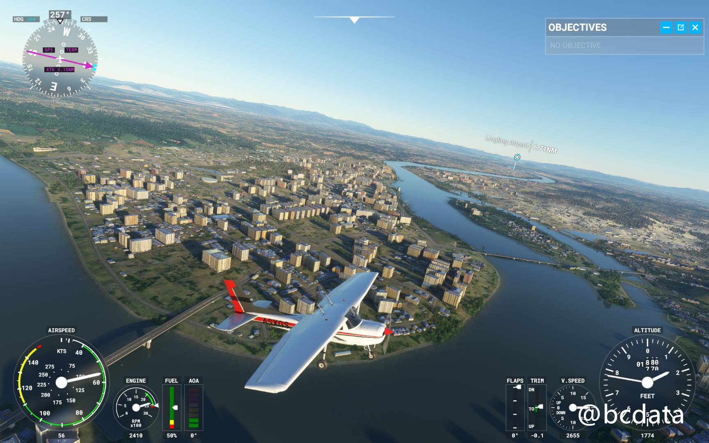
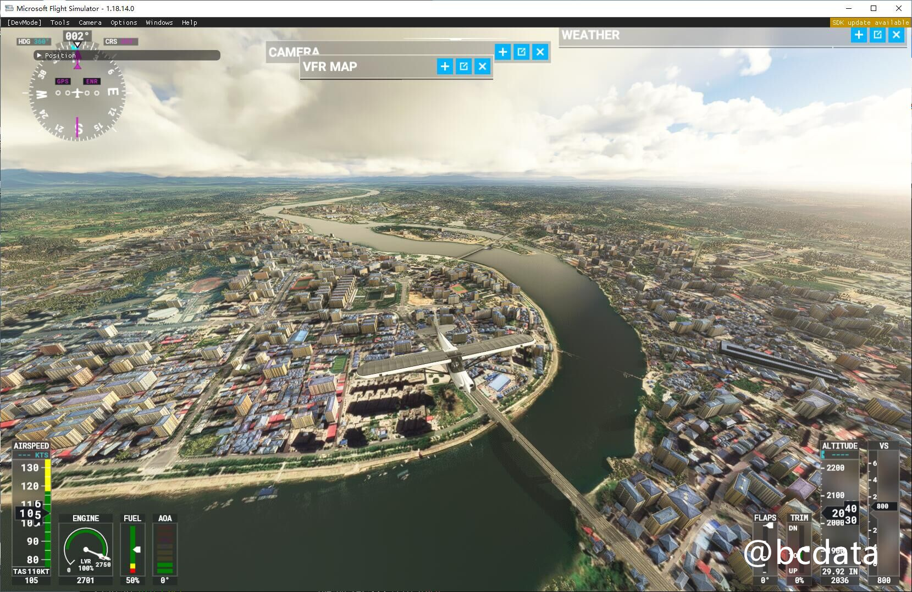
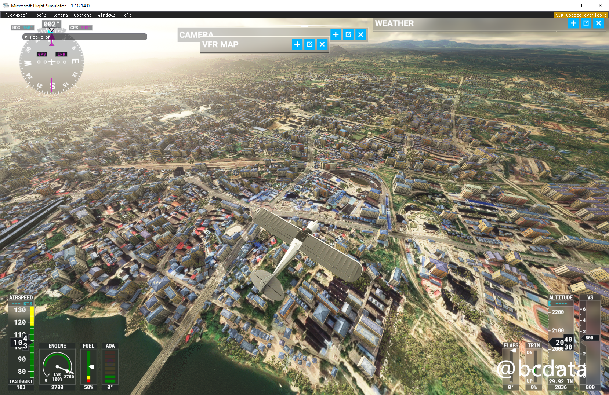
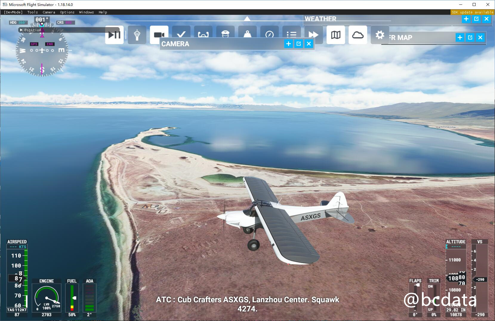
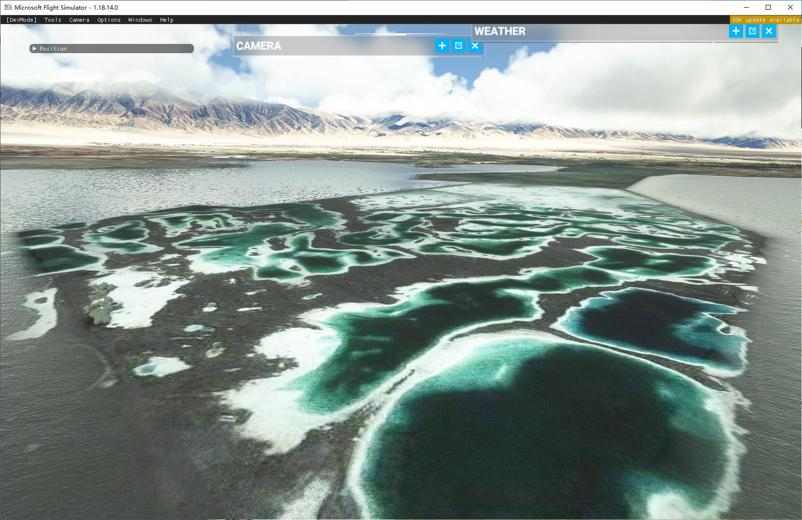
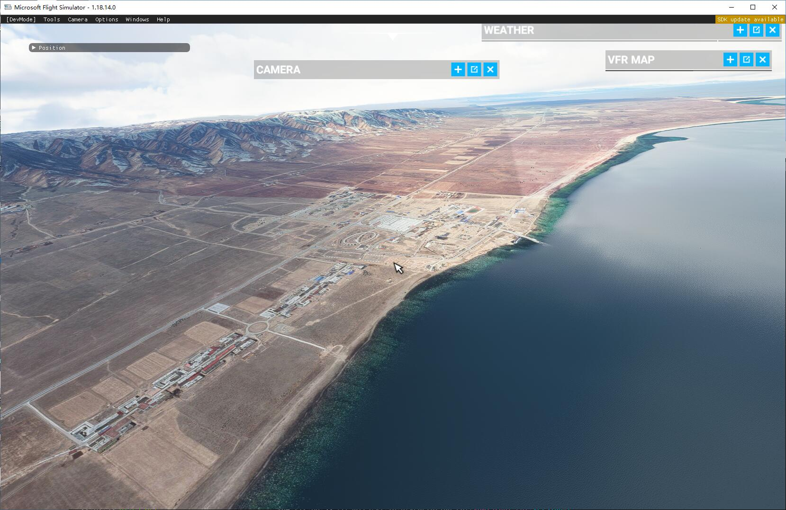
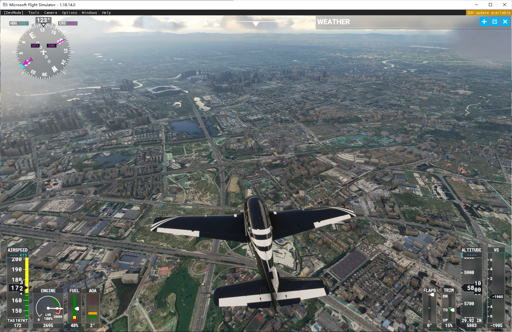
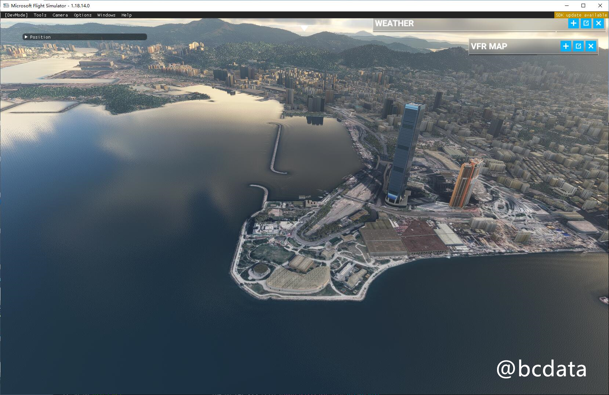

# English verison

## Disclaimer

The methods mentioned in this tutorial are for research and learning purposes only. I am not responsible for any legal liabilities and losses caused by using or expanding this tutorial and method.

## Principle

Replace the local DNS and replace the Microsoft server with the local server. Please install the tools involved
* An HTTP proxy that can access Google (you may not need this if you are outside China)

## Can and can't
### Can:

* Replace bing sattelite image with google's image
* Somewhere bing sattelite image not cover (which display as autogenerated image) can be replaced with google's image
* Google's image has better quality and more recent than bing's
* Remove microsoft's color correction, which bring the nature color back
* 
### Can't

* Autogenerated building, trees, roads stay same as before
* Photogrammetry not included

## Steps for usage

Some virus app reports errors and when in game it promote for https certificate error. If so, please add the folder to whitelist and accept the certificate error.
The software is totally open source and you can check every piece of code here: https://github.com/derekhe/msfs2020-google-map

* Download the release compressed package and unzip it
* Modify the `url` in config.ini to the proxy that you can access Google (if you are not in China, please delete this line)
* Run `server.exe` to start the server, keep the command line screen open
* Start flight simulation
* Enjoy
* If you want exit the game, please close the command line using `ctrl+c`

To restore the previous state, please delete
The following two lines in the `C:\Windows\System32\drivers\etc\hosts` file:
```
127.0.0.1 kh.ssl.ak.tiles.virtualearth.net
127.0.0.1 khstorelive.azureedge.net
```

## Offline download

In order to solve the problem of real-time loading, you can use the built-in offline loading of msfs2020, but it is not easy to operate.
So I made an `offline-cache.exe` for downloading, and the map can be preloaded. After that, the map is loaded very quickly.
Edit the following fragment in the `config.ini` file. It is not recommended to use too large range and too fine series.

```
[offline]
# Use https://www.google.com/maps to get coordinate points
north_west = 46.357879198300516, 83.39287198273128
south_east = 22.89205887817234, 123.91045032827455
# From how many levels to how many levels, the maximum is 18 levels
range = 5, 12
# The maximum number of G for the cache
max_cache_size_G = 20
```

## background

Microsoft Flight Simulator 2020 uses Bing's satellite map. However, the satellite map is relatively old, and many areas are not directly equipped with map settings a few years ago. This phenomenon occurs in different regions of the world. The map on the mainland is even 10 years ago. There are a large number of regions where satellite images are not available. Microsoft uses the program-generated map instead, and the quality is very poor. After the replacement, the image quality and details have been significantly improved, as shown in the figure below

## Original map


## You can get the latest high-definition images after replacing Google Maps

### A small town



### Qinghai Lake (These satellite images do not exist in Bing)





### Chengdu



### Hongkong




## History and related information

I have been studying the possibility of replacing it with Google Maps for a long time, and there are also YouTubers on the Internet who have provided [some ideas](https://flightsim.to/file/4074/google-earth-decoder-optimisation-tools?__cf_chl_jschl_tk__= pmd_2902fb008a3441de2f812b093625596ad796f737-1628304162-0-gqNtZGzNAk2jcnBszQjO), use a crawler to crawl the data from Google and import it into MSFS2020. But this method is more complicated and cannot be used on a large scale.

Later I studied the network request and found that MSFS will download pictures from Bing's server. In theory, it should be possible to replace the pictures with other pictures. And it happens that the slicing method of bing and google’s satellite images is similar and can be seamlessly switched, and even Microsoft also provides the converted [source code] (https://docs.microsoft.com/en-us/bingmaps/articles/ bing-maps-tile-system) (see this function QuadKeyToTileXY)

In the process of constant search, I found [examples similar to my thinking](
https://github.com/muumimorko/MSFS2020_CGLTools/issues/2#issuecomment-762232597). But his main purpose is to remove some unnecessary things to improve the quality of the landscape. He also built an additional warehouse to demonstrate a [method of using proxy to replace landscape] (https://github.com/muumimorko/MSFS2020_Proxy). Unfortunately, this warehouse lacks some necessary things and cannot operate normally.


# Sponsor

If you have successfully achieved it, please give a star and let more people see it!
If you are willing to give some sponsorship to the author, please scan the following QR code to support the author.


