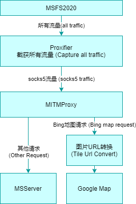
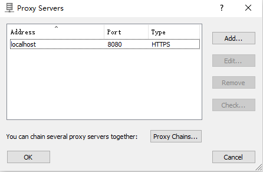
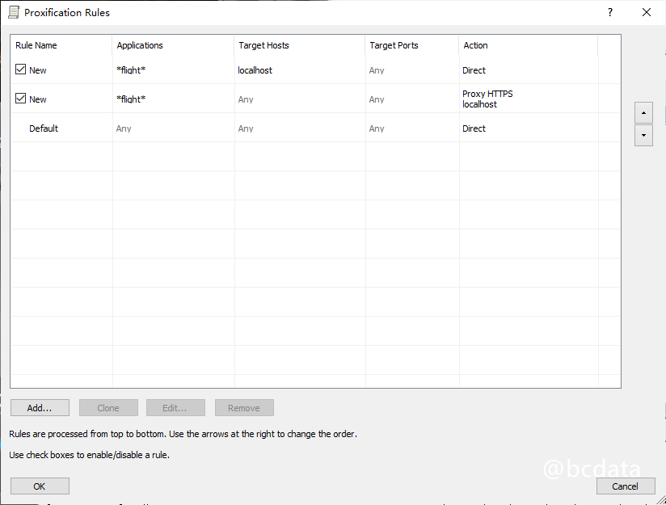
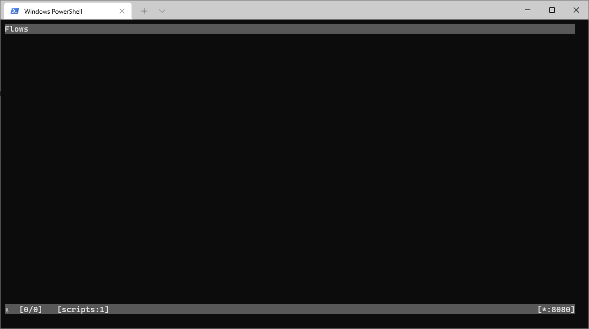
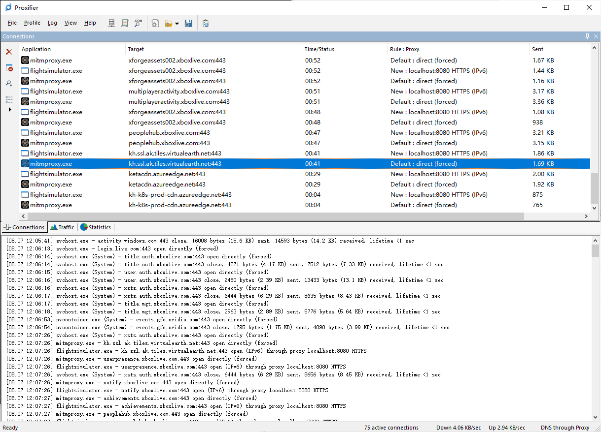
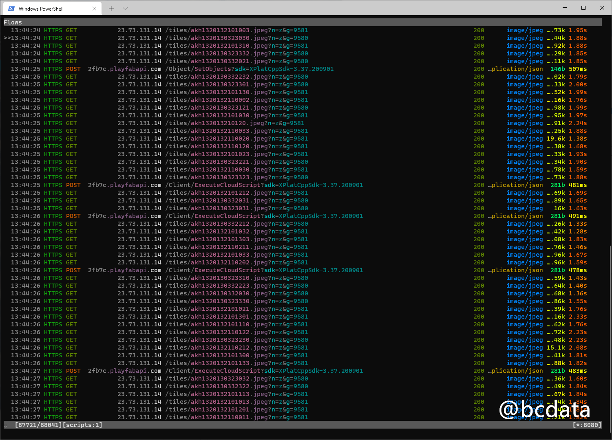
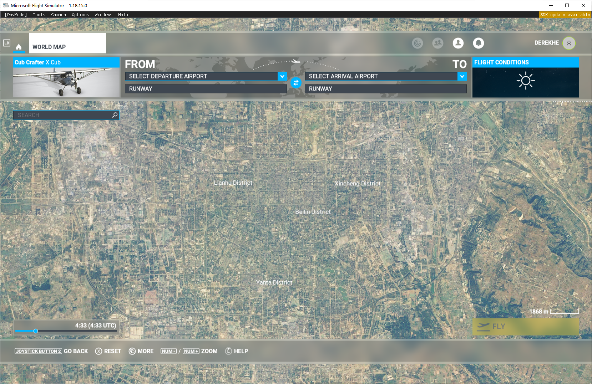

# English
## Disclaimer

The methods mentioned in this tutorial are for research and learning purposes only. I am not responsible for any legal liabilities and losses caused by using or expanding this tutorial and method.

## background

The landscape of Microsoft Flight Simulator 2020 uses Bing's satellite map, but the satellite map is relatively old, and many areas are directly missing from the map settings a few years ago. This phenomenon occurs in different regions of the world. The map on the China mainland is even 10 years ago. There are a large number of regions where satellite images are not available. Microsoft uses the program-generated maps instead, and the quality is very poor. After the replacement, the image quality and details have been significantly improved, as shown in the figure below

## Original map

## You can get the latest high-definition images after replacing Google Maps

### A small town

### Qinghai Lake (These satellite images do not exist in Bing)

### Chengdu

### Hongkong

## History and related information

I have been studying the possibility of replacing it with Google Maps for a long time, and there are also YouTubers on the Internet who have provided [some ideas](https://flightsim.to/file/4074/google-earth-decoder-optimisation-tools?__cf_chl_jschl_tk__= pmd_2902fb008a3441de2f812b093625596ad796f737-1628304162-0-gqNtZGzNAk2jcnBszQjO), use a crawler to crawl the data from Google and import it into MSFS2020. But this method is more complicated and cannot be used on a large scale.

Later, I studied the network request and found that MSFS will download pictures from bing's server. In theory, it should be possible to replace the pictures with other pictures. And it happens that the slicing method of bing and google’s satellite images is similar and can be seamlessly switched, and even Microsoft also provides the converted [source code] (https://docs.microsoft.com/en-us/bingmaps/articles/ bing-maps-tile-system) (see this function QuadKeyToTileXY)

In the process of constant search, I found [examples similar to my thinking](
https://github.com/muumimorko/MSFS2020_CGLTools/issues/2#issuecomment-762232597). But his main purpose is to remove some unnecessary things to improve the quality of the landscape. He also built an additional warehouse to demonstrate a [method of using proxy to replace landscape] (https://github.com/muumimorko/MSFS2020_Proxy). Unfortunately, this warehouse lacks some necessary things and cannot operate normally.

## Principle

Drawing lessons from the above ideas, I sorted out the following methods to achieve traffic interception and modification.

Please install the tools involved
* [mitmproxy](https://mitmproxy.org/)
  * Install the latest version
  * Ensure that the https certificate of mitmproxy is correctly installed and added to the trust list of the system, otherwise the traffic cannot be hijacked
  * refer to
    * https://docs.mitmproxy.org/stable/concepts-certificates/
    * https://docs.mitmproxy.org/stable/overview-getting-started/
* [proxifier](https://www.proxifier.com/)
  * Setting up a Windows global proxy does not transfer map-related traffic to mitmproxy. Proxifier can forward the traffic of the process to the upper proxy to achieve the purpose. Maybe there are other options available.
* [python3](https://www.python.org/downloads/)
  * Install all the contents of version 3.8
* [python3 requests library](https://docs.python-requests.org/en/master/)
  * Use `pip3 install requests` to install
* An HTTP proxy that can access Google

Implementation steps

* (Domestic users) Turn off any accelerator, otherwise the traffic will not be hijacked
* Install Proxifier and set up proxy configuration (my version is 4.0.3 version). The proxy is set to the port number of mitmproxy (default 8080)
   
* **In order** Configure Proxifier's proxy rules:
  * Send the traffic of localhost corresponding to the `*flight*` process to Direct (direct connection)
  * Send other traffic of the `*flight*` process to the proxy configured above
  
* Modify `proxy_url` in mitm.py to a proxy that you can access Google
* Run `run.bat` in the current directory to start mitmproxy
  
* Start flight simulation
* At this time, the proxifier will intercept the traffic, and mitmproxy will also display the traffic. These jpeg traffic is the satellite image
  
  
* Enjoy
  

# Sponsor

If you have successfully achieved it, please give a star and let more people see it!

If you are willing to give some sponsorship to the author, please scan the following QR code to support the author.

Wechat 

Alipay
